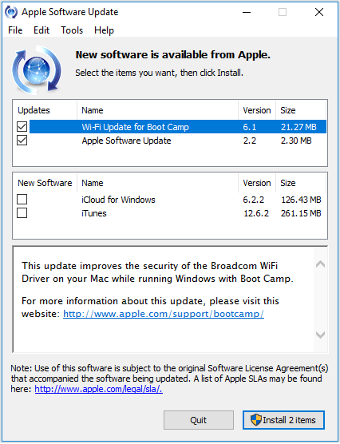
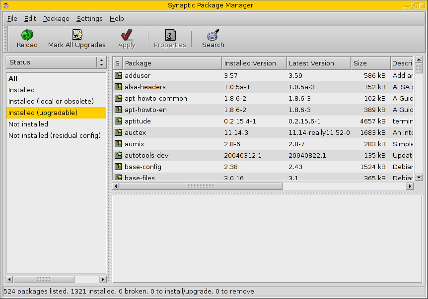

[Continued from part i](https://jasonsackey.wordpress.com/2018/11/26/software-updates-part-i/)

Frequently-updated software is the norm. The frequency varies, of course, depending on the particular software. Generally, developers depend on it.

Without updates, internet-connected (read: pretty much all) software would be increasingly vulnerable to hacking as security flaws are continually discovered. And without the ability to continually improve software through updates, a developer would find their products left behind, outpaced by relentless competition.

## The user experience of software updates

In the bad old days, software updates were distributed as separate programs. You went to the publisher or developer's website to download a newer version. How did you know to do this? Maybe a colleague told you. Maybe the developer emailed you. Maybe you didn't know.

The next step was _patches,_ updates delivered as programs that update your currently installed version to a later one. So you didn't need to reinstall the software, and there was a smaller file to download.

Then, programs started checking for available updates. Thus began the process of update delivery mechanisms becoming more closely integrated into software. Self-updating software wasn't far off, as is common in web browsers nowadays.

Should software simply automatically update itself, without any action on the part of users? Opinions vary. It's perhaps more appropriate for some sorts of software than others. Users can understandably get annoyed at software updates--changed features may not necessarily be experienced as improvements. Sometimes users just want things to stay the way they are. So even though it's possible nowadays to develop software that automatically keeps itself up to date as long as it's connected to the internet, developers often give users the final decision.

<figure>

<figcaption>

Apple software update

</figcaption>

</figure>

Having each individual item of software handle its own updates was an unwieldily, convoluted situation. It made sense to try to de-duplicate this functionality, to combine shared functionality. So, companies like Apple made software update management programs, like that above.

And in the free open sauce world, Linux program updates are generally managed all in one unified manner, by '[package mangers](https://en.wikipedia.org/wiki/Package_manager)'. There are multiple package managers, but user will generally use only one. Different distributions of the OS come with different PMs, administered by different organisations.

In the commercial world Apple and Adobe have their own separate update managers and users of Apple and Adobe software on the same computer will have both. And there are other commercial software update managers to deal with...

There could have been an awful, unmanageable proliferation of these, but luckily we were saved! Steam sorted out the situation in gaming, by becoming the undisputed leader in PC game distribution. Steam sends us the games, updates and all.

Mobile phone and tablet operating systems are more locked-down than PCs (including Macs). On iOS, all software comes via the official App Store. On Android, Google's store is the default but not the only option.

Apple and Microsoft have their PC operating systems too. They come with app stores, which helpfully unify and coordinate the update process for software within their remit, but they are still only one of many ways to get software onto those systems.

## The Wild Web

The Web app update procedure is seamless and effortless for a user. You open the page, and an updated version of the app is just there.

They are updated whenever their owner decides to update them, and too bad for any user who preferred the old one. For larger applications, when there's a big version change, a developer with lots of resources may give users the option to stick with the older version for a while.

Keeping web backend software updated is an unsolved problem. Popular content management systems like WordPress and Drupal get a steady stream of updates to address security issues, but they're generally not automatically updated. Many instances remain out of date. Sometimes they get hacked, and are used to attack other sites.

An update might screw something up and cause the system, say, a blog with 100s of treasured posts, to lose data. So the onus is placed on the site owner (or their delegated administrator) to press the update button and accept the consequences. If the database gets corrupted, well, you should have updated it.

## Reversibility

Wouldn't it be great if we could rewind and undo a software update? Restore to a previous state. It should be easy! But sadly, the complexity of systems doesn't allow this. Not yet, anyway.

_Part III coming this week!_
